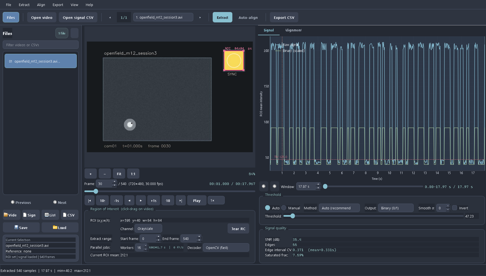
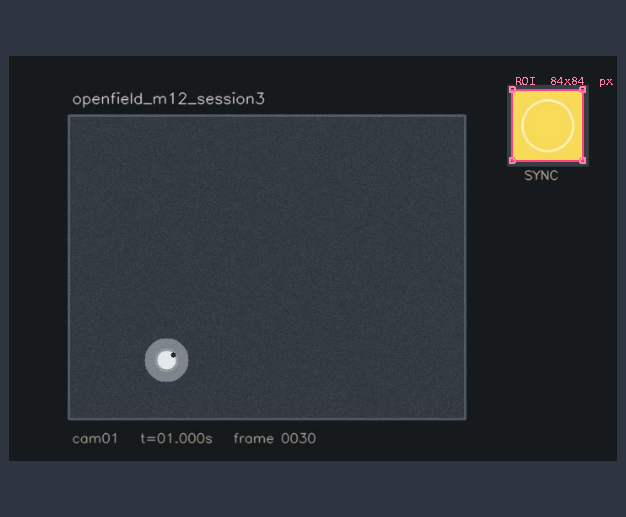
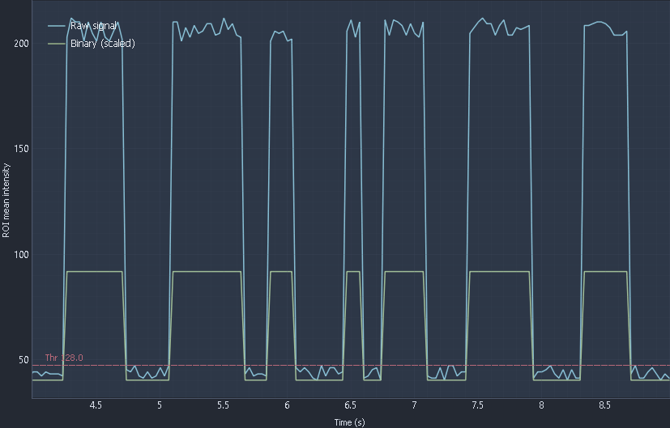
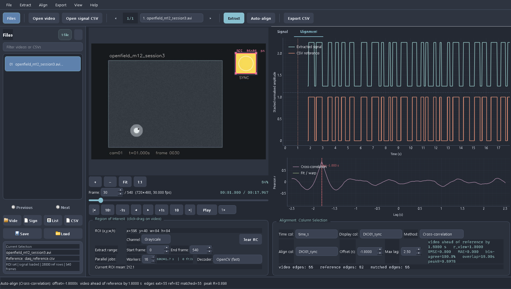
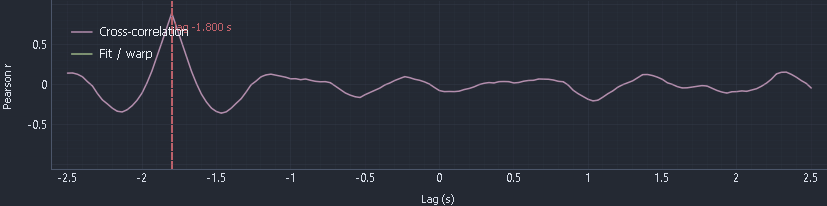
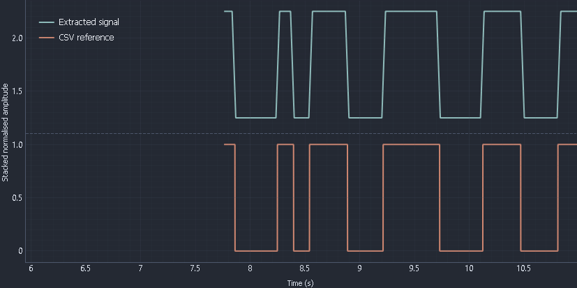

<h1 align="center">🎬 Video Barcode Signal Extractor</h1>

<p align="center">
  <b>Turn a blinking light in a video into a clean timing signal,<br>
  then snap it perfectly onto the rest of your recording.</b>
</p>

<p align="center">
  <i>Built for the lab bench, not the textbook.</i> 🧪
</p>

<p align="center">
  
</p>

---

## 👋 What is this thing?

You filmed an experiment. Somewhere in the corner of that video there is a little
light that blinks - an LED, a screen flash, a "barcode" sync pulse. That blinking
is the heartbeat that tells you *exactly when* things happened.

The problem? That heartbeat is trapped inside a video file, and your other gear
(the electrophysiology rig, the DAQ, the behaviour box) is ticking on its own
clock. Lining them up by hand is tedious, error-prone, and frankly nobody's idea
of fun.

**This app does it for you.** Draw a box around the blinking light, hit a button,
and out comes a tidy signal. Drop in the recording you want to match, click
*Auto-align*, and watch the two snap together like puzzle pieces. 🧩

---

## ✨ The whole story in four pictures

### 1. Point at the blinking light 🔦

Drag a box around your sync LED. That pink rectangle is the only thing the app
cares about - everything else in the frame is ignored.

<p align="center">
  
</p>

### 2. Get a clean signal out 📈

The app reads how bright that little box is, frame by frame, and hands you a
crisp on/off trace. The wiggly line is the raw brightness; the square line is the
"is the light on or off?" answer, with the on/off threshold drawn right on top.

<p align="center">
  
</p>

### 3. Line it up with your recording 🎯

Open the signal you actually want to sync to (your DAQ export, a TTL channel, a
photodiode trace) and press **Auto-align**. The app slides the two signals past
each other until they match best.

<p align="center">
  
</p>

That sharp spike below is the app saying *"found it!"* - the exact time shift
between your video clock and your recording clock.

<p align="center">
  
</p>

### 4. Admire the perfect fit 😎

Zoom in and every edge lines up. Top trace is from the video, bottom trace is from
your recording. Same beats, same timing, finally on the same clock.

<p align="center">
  
</p>

---

## 🧠 Why you'd actually want this

If you do anything where **video has to agree with another stream of data**, this
saves you a real headache:

- 🐭 Behaviour videos that need to match neural recordings
- ⚡ Lining camera frames up with electrophysiology or imaging
- 🔬 Any "this happened *when* exactly?" question across two devices

Instead of squinting at timestamps and nudging things by hand, you get a number,
a picture that proves it worked, and an exported file you can trust.

---

## 🚀 Get going in 60 seconds

You'll need Python 3.11. Then:

```powershell
# 1. Grab the dependencies
py -3.11 -m pip install -r requirements.txt

# 2. Launch it
py -3.11 main.py
```

Already know which video you want? Hand it over directly:

```powershell
py -3.11 main.py "C:\path\to\your\video.mp4"
```

That's it. Draw a box, extract, align, export. ✅

---

## 🛠️ A few handy extras

**Already extracted the signal elsewhere?** No problem. Use
`File ▸ Open source signal CSV...` (or the *Open signal CSV* button) to load a
ready-made trace instead of pulling it from video. Pick its time and value
columns, open your reference, and align exactly as above.

**Want a few different ways to align?** You get cross-correlation (one global
shift), edge-based matching, linear regression (handles slow clock drift), and
DTW for the trickier nonlinear cases. Most of the time the default just works.

**Prefer a double-click app?** Build a standalone Windows version:

```powershell
py -3.11 -m PyInstaller --clean --noconfirm VideoBarcodeSignalExtractor.spec
```

It lands in `dist\VideoBarcodeSignalExtractor\`, ready to share with labmates who
would rather not touch a terminal.

**Running the tests** (some environments auto-load unrelated pytest plugins, so
we switch that off):

```powershell
$env:PYTEST_DISABLE_PLUGIN_AUTOLOAD = "1"
py -3.11 -m pytest -q
```

---

## 💚 Made with care

Built for researchers who would rather spend their time on the science than on
wrestling timestamps into submission. If it saves you an afternoon, it did its job.

<p align="center">
  <sub>Got a video and a blinking light? You're already most of the way there.</sub>
</p>
